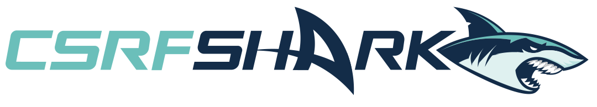

    
    <h1 align="center">CSRFShark</h1>
     

`CSRFShark` is a utility for manipulating cross-site Request forgery (CSRF) attacks.

It allows to easily generate a CSRF PoC based on a given HTTP/CURL requests with further possibility to get a permanent link to the result.

## 📚 Contents
- [🚀 Getting started](#--getting-started)
- [✨ Features](#--features)
- [🌐 Supported languages](#--supported-languages)
- [✅ Supported CSRF PoC techniques](#--supported-csrf-poc-techniques)
- [👤 Author](#--author)
- [⚠️ Legal disclaimer](#-️-legal-disclaimer)
- [⚖️ License](#-️-license)

##  🚀 Getting started
**`CSRFShark` offers a hosted solution located at https://csrfshark.github.io/app**

If you want to host `CSRFShark` on your local machine, several start options are available:
- [Download the latest release](https://github.com/csrfshark/app/archive/v1.0.0.zip)
- Clone the repo: `git clone https://github.com/csrfshark/app`

##  ✨ Features
- **Share** - allows you to easily and quickly get a permanent link to the result. All necessary data for PoC will be stored in the URL Hash.
- **Client-Side Rendering** - all data is generated on the client side using JavaScript.
- **Privacy** - through the use of URL Hash technology, the server has no information about the client request and the created PoC.
- **Real-Time run** - check that the attack works in real-time.

##  🌐 Supported languages
- **English**
- **Russian**
- **Ukrainian**
- **Spanish**

##  ✅ Supported CSRF PoC techniques
- **Form** - a simple HTML form that includes hidden inputs and a submit button.
- **XMLHttpRequest** - makes a HTTP request in JavaScript via XMLHttpRequest class.
- **XMLHttpRequest + Stats** - same as XMLHttpRequest, but also includes code to display request statistics.
- **Link** - a simple HTML `<a>` tag.
- **Img** - a simple HTML `` tag.

##  👤 Author
[f0rb1dd3n0x193](https://t.me/f0rb1dd3n0x193)

##  ⚠️ Legal disclaimer
This tool is for educational purpose only. It is illegal to use this program to attack targets without prior mutual consent. It is the end user's responsibility to obey all applicable local, state and federal laws. Developers assume no liability and are not responsible for any misuse or damage cause by this program.

##  ⚖️ License
Licensed under the [MIT](https://github.com/csrfshark/app/blob/main/LICENSE) License.